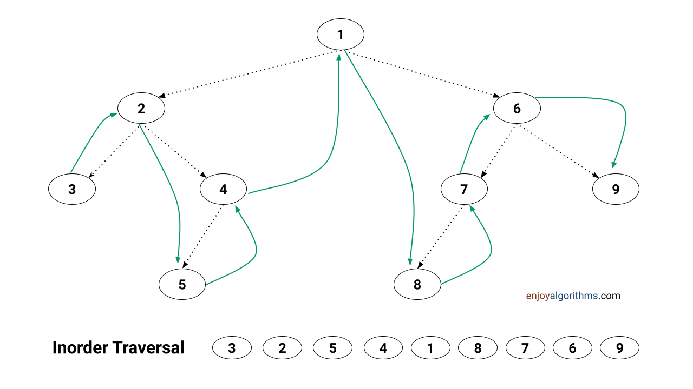

# DFS in binary trees


## In-Order Traversal



### > Variant 1. Using Stack and zero pointers
```cpp
template<typename TVisitor>
bool isValidBST_V1(TreeNode* root, TVisitor visitor) {
    if (!root) {
        return true;
    }

    std::vector<const TreeNode*> dfs;
    for (const TreeNode* node = root; dfs.size() || node; ) {
        if (node) {
            dfs.push_back(node);
            node = node->left;
        }
        else if (node = dfs.back(); visitor(node)) {
            dfs.pop_back();
            node = node->right;
        }
        else {
            return false;
        }
    }
    return true;
}
```

### > Variant 2. Using Stack and empty bracnhes avoiding
```cpp
template<typename TVisitor>
bool isValidBST_V1(TreeNode* root, TVisitor visitor) {
    if (!root) {
            return true;
        }

        std::vector<const TreeNode*> dfs({nullptr});
        for (const TreeNode* node = root; dfs.size() && node; ) {
            if (node->left && node != dfs.back()) {
                dfs.push_back(node);
                node = node->left;
                continue;
            }
            if (!visitor(node)) {
                return false;
            }
            if (node == dfs.back()) {
                dfs.pop_back();
            }
            if (node->right) {
                node = node->right;
                continue;
            }
            node = dfs.back();
        }
        return true;
}
```
