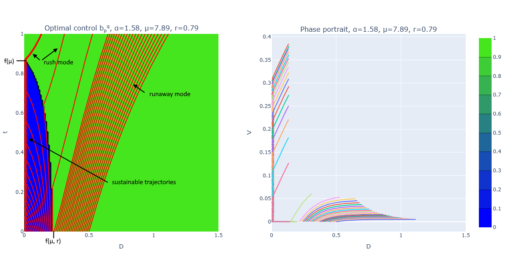
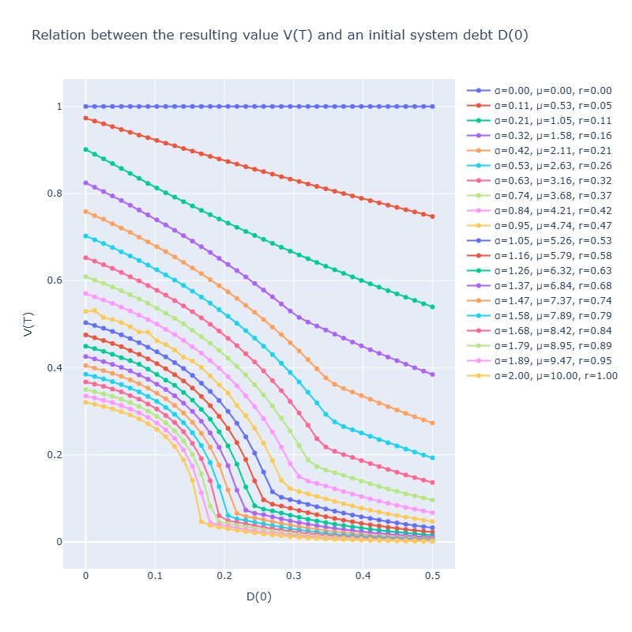
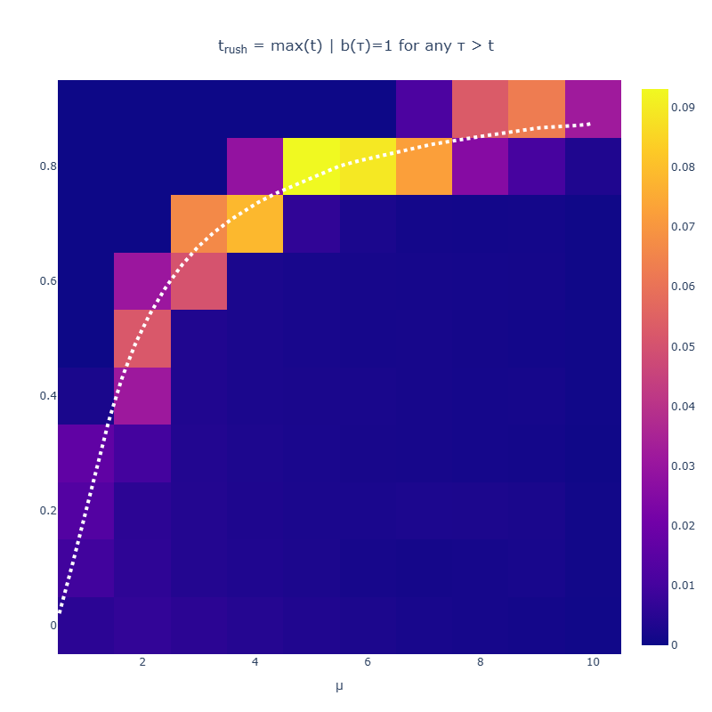

# Optimal control: Review cycles <!-- omit from toc -->

In this scenario we have a limited amount of time ($t \in [0; T]$) and want to maximize the final produced value $V(T) \rightarrow max$ and ignore the resulting debt level $D(T)$, which is typical for some product teams. For simplicity, efficiency factors are constant: $α(t) = const$, $β(t) = const$.

$$
\begin{equation}
    \left\{
    \begin{aligned}
        D(0) & = D_0 \\
        V(0) & = V_0 \\
        D(T) & = \text{free} \\
        V(T) & \rightarrow max \\
    \end{aligned}
    \right.
\end{equation}
$$

## 1. Optimisation problem

### 1.1. HJB problem

In this problem we deal with a so-called Mayer problem $J = \Phi(\vec{x}(T))$. From a practical point of view, the problems can be solved using HJB with this value-to-go function:

$$
\begin{equation}
    \left\{
    \begin{aligned}
        W(\vec{x}, t) & = \sup_{\vec{u}(\cdot)} \Phi(\vec{x}(T)) \\
        W(\vec{x}, T) & = \Phi(\vec{x}(T)) & \text{; terminal condition} \\
    \end{aligned}
    \right.
\end{equation}
$$

These problems can be solved iteratively on grids, for which we need to substitute $T = t + Δt$:

$$
\begin{equation}
    W(\vec{x}, t) = \sup_{\vec{u}(\cdot)} W(\vec{x}(t + Δt), t + Δt)
\end{equation}
$$

Then let's Taylor-expand the $\vec{x}(t + Δt) \simeq \vec{x}(t) + \dot{\vec{x}}(t) \cdot Δt$:

$$
\begin{equation}
    W(\vec{x}, t) = \sup_{\vec{u}(\cdot)} W(\vec{x}(t) + \dot{\vec{x}}(t) \cdot Δt, t + Δt)
\end{equation}
$$

The resulting algorithm is:

- Compute the matrix $w^{n}$;
- Assume the matrix $w^{n + 1}$ is already known;
- For each element of $w^{n}$, compute $\vec{x}(t + Δt)$;
- Find the interpolation $Γ\{w^{n+1}\}(\vec{x}(t + Δt))$ for each plausible control;
- Update $w^{n}(\vec{x}(t)) = \max_{\vec{u}(\cdot)} \left[ Γ\{w^{n+1}\}(\vec{x}(t + Δt)) \right]$;

### 1.2. Hard constraints

The original problem is constrained ($V \in [0, +∞)$ and $D \in [0, +∞)$) and if the solver goes beyond 0, we are drastically changing the optimisation problem. To fulfill this constraint automatically we can require drifts on borders be directed inwards or tangential to the allowed domain: $\{\dot{D} ≥ 0 | D = 0\}$ and $\{\dot{V} ≥ 0 | V = 0\}$.

### 1.3. Exponential growth

We are going to solve the optimisation problem on grids, for which we should remain in the computational domain. However, as $D$ can grow exponentially, we have to project it to a more compact space; we can use the bijection $d = \log(D + 1) \in [0, +∞)$ and $D = e^d - 1 \in [0, +∞)$.

### 1.4. Numeric stability

For numerical stability, we have to satisfy the CFL condition for each dimension $x_k$ for the layer $t$:

$$
\begin{equation}
    \max_{u(\cdot)} \{ |\dot{x_k}(t)| \text{ | } \forall \vec{x} \} \cdot \dfrac{Δt}{Δx_k} = \text{CFL} ≤ 1
\end{equation}
$$

This can be done automatically by using upwind adaptive time grids (we compute $Δt$ from $w^{n+1}$ drifts):

$$
\begin{equation}
    Δt = \text{CFL} \cdot \min_k \dfrac{Δx_k}{\max_{u(\cdot)} \{ |\dot{x_k}(t)| \text{ | } \forall \vec{x} \}}
\end{equation}
$$

<!-- =========================================================================================== -->

## 2. Model Investigations

### 2.1. Model A

#### 2.1.1. Switching curves

For this problem we have the following Hamiltonian:

$$
\begin{equation}
    \begin{aligned}
        H & = \psi_V(t) \cdot b(t) \cdot \dfrac{1}{1 + μ D} \\
          & + \psi_D(t) \cdot \left( ((α + β) \cdot b(t) - β) \cdot \dfrac{1}{1 + μ D} + r D \right) \\
    \end{aligned}
\end{equation}
$$

Which yields the following conjugate variables $\psi$:

$$
\begin{equation}
    \left\{
    \begin{aligned}
        \dot{\psi_V} & = -\dfrac{\partial H}{\partial V} = 0 \\
        \dot{\psi_D} &
            = -\dfrac{\partial H}{\partial D}
            = \left( \psi_V(t) \cdot b(t)
            + \psi_D(t) \cdot ((α + β) \cdot b(t) - β) \right) \cdot \dfrac{μ}{(1 + μ D)^2}
            - \psi_D(t) \cdot r
    \end{aligned}
    \right.
\end{equation}
$$

From which we have:

$$
\begin{equation}
    \left\{
    \begin{aligned}
        & \psi_V(t) = C_V \\
        & \psi_V(T) = 1 \\
    \end{aligned}
    \right.

    \Rightarrow

    \psi_V(t) = 1

\end{equation}
$$

Then, notice that our $H(\cdot)$ is linear in $b(t)$, so we have a bang-bang optimal control:

$$
\begin{equation}
    b(t) = \arg \max_{b(t) \in [0; 1]} H(\cdot)
\end{equation}
$$

$$
b(t)=
\begin{cases}
    1               & dH/db > 0 \\
    0               & dH/db < 0 \\
    \text{singular} & dH/db = 0 \\
\end{cases}
$$

After all substitutions and singularity elimination we have:

$$
\begin{equation}
    \dfrac{dH}{db}
        = \left( \psi_V(t) + \psi_D(t) \cdot (α + β) \right) \cdot \dfrac{1}{1 + μ D}
\end{equation}
$$

$$
\begin{equation}
    \begin{aligned}
        \operatorname{sign}\dfrac{dH}{db}
            & = \operatorname{sign} (1 + \psi_D(t) \cdot (α + β)) \\
            & = \operatorname{sign} (\psi_D(t) + \dfrac{1}{(α + β)})
    \end{aligned}
\end{equation}
$$

$$
\begin{equation}
    b_{\text{opt}}(t) = b(t)= \left\{ \psi_D(t) > -\dfrac{1}{(α + β)} \right\}
\end{equation}
$$

And as $\psi_D(T) = 0$, we have that $b(T) = 1$.

#### 2.1.2. Borders

$$
\begin{equation}
    \left\{
    \begin{aligned}
        \dot{V}(t, V = 0) & = b(t) \cdot \dfrac{1}{1 + μ D} ≥ 0 \\
        \dot{D}(t, D = 0) & = ((α(t) + β(t)) \cdot b(t) - β(t)) \cdot \dfrac{1}{1 + μ D} + r D ≥ 0 \\
    \end{aligned}
    \right.
\end{equation}
$$

For $V = 0$ this is always true, for $D = 0$ we have:

$$
\begin{equation}
    b ≥ \dfrac{β}{α + β} > 0

    \Rightarrow

    b = 1
\end{equation}
$$

### 2.2. Model B

#### 2.2.1. Switching curves

For this problem we have the following Hamiltonian:

$$
\begin{equation}
    \begin{aligned}
        H & = \psi_V(t) \cdot b(t) \cdot e^{-μ D} \\
          & + \psi_D(t) \cdot \left( ((α + β) \cdot b(t) - β) \cdot e^{-μ D} + r D \right) \\
    \end{aligned}
\end{equation}
$$

Which yields the following conjugate variables $\psi$:

$$
\begin{equation}
    \left\{
    \begin{aligned}
        \dot{\psi_V} & = -\dfrac{\partial H}{\partial V} = 0 \\
        \dot{\psi_D} &
            = -\dfrac{\partial H}{\partial D}
            = μ e^{-μ D} \left( \psi_V(t) \cdot b(t)
            + \psi_D(t) \cdot ((α + β) \cdot b(t) - β) \right)
            - \psi_D(t) \cdot r
    \end{aligned}
    \right.
\end{equation}
$$

From which we have:

$$
\begin{equation}
    \left\{
    \begin{aligned}
        & \psi_V(t) = C_V \\
        & \psi_V(T) = 1 \\
    \end{aligned}
    \right.

    \Rightarrow

    \psi_V(t) = 1

\end{equation}
$$

Then, notice that our $H(\cdot)$ is linear in $b(t)$, so we have a bang-bang optimal control:

$$
\begin{equation}
    b(t) = \arg \max_{b(t) \in [0; 1]} H(\cdot)
\end{equation}
$$

$$
b(t)=
\begin{cases}
    1               & dH/db > 0 \\
    0               & dH/db < 0 \\
    \text{singular} & dH/db = 0 \\
\end{cases}
$$

After all substitutions and singularity elimination we have:

$$
\begin{equation}
    \dfrac{dH}{db}
        = \left( \psi_V(t) + \psi_D(t) \cdot (α + β) \right) \cdot e^{-μ D}
\end{equation}
$$

$$
\begin{equation}
    \begin{aligned}
        \operatorname{sign}\dfrac{dH}{db}
            & = \operatorname{sign} \left( (1 + \psi_D(t) \cdot (α + β)) \cdot e^{-μ D} \right) \\
            & = \operatorname{sign} (1 + \psi_D(t) \cdot (α + β)) \\
            & = \operatorname{sign} (\psi_D(t) + \dfrac{1}{(α + β)})
    \end{aligned}
\end{equation}
$$

$$
\begin{equation}
    b_{\text{opt}}(t) = b(t)= \left\{ \psi_D(t) > -\dfrac{1}{(α + β)} \right\}
\end{equation}
$$

And as $\psi_D(T) = 0$, we have that $b(T) = 1$.

#### 2.2.2. Borders

$$
\begin{equation}
    \left\{
    \begin{aligned}
        \dot{V}(t, V = 0) & = b(t) \cdot e^{-μ D}  ≥ 0 \\
        \dot{D}(t, D = 0) & = ((α(t) + β(t)) \cdot b(t) - β(t)) \cdot e^{-μ D} + r D  ≥ 0 \\
    \end{aligned}
    \right.
\end{equation}
$$

For $V = 0$ this is always true, for $D = 0$ we have:

$$
\begin{equation}
    b ≥ \dfrac{β}{α + β} > 0

    \Rightarrow

    b = 1
\end{equation}
$$

## 3. System Behaviour

### 3.1. Objective

The resulting value function $W$ can be decomposed as $W(V, D, t) = V(t) + W(D, t)$:

$$
\begin{equation}
    \begin{aligned}
        W(V, D, t)
            & = \sup_{u(\cdot)} V(T) \\
            & = \sup_{u(\cdot)} \left[ V(t) + \int_t^T \dot{V}(D(τ), τ) \cdot dτ \right] \\
            & = V(t) + \sup_{u(\cdot)} \left[ \int_t^T \dot{V}(D(τ), τ) \cdot dτ \right] \\
            & = V(t) + W(D, t)
    \end{aligned}
\end{equation}
$$

Thus the problem can be solved on a reduced 2D grid $(D, t)$ with the following terminal condition:

$$
\begin{equation}
    W(D, T) = 0
\end{equation}
$$

And the following running cost:

$$
\begin{equation}
    L = \dot{V}(D(t), t)
\end{equation}
$$

### 3.2. Simulation Results

- $α \in [0; 2]$;
- $μ \in [0; 10]$;
- $r \in [0; 1]$;

In general, both models (A) and (B) yield similar $(D, t)$ trajectories with two major families:

- **Sustainable trajectories** with manageable initial debt, which:
  - try to minimize debt to a minimum level,
  - maintain that minimum debt level,
  - then switch to a "rush" mode before the deadline;

- **Runaway trajectories** with heavy initial debt;

The time when trajectories switch to rush depends primarily on system viscosity μ:

- When viscosity is high, more than 80% of the period should be in a debt-maintenance mode;
- The remaining less than 20% of the time before the deadline should be focused on new features;

